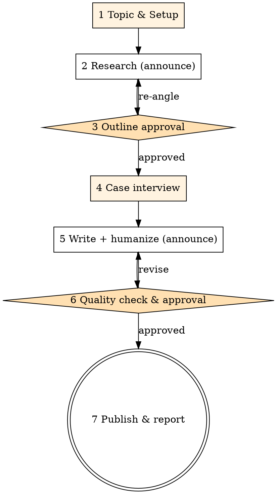

# Auto SEO Writer

Guided SEO/AEO article generator. One article = **7 steps**. At every step,
tell the user in 1–2 sentences what this step does, then either offer options
(recommended default first) or announce-and-proceed. Experienced users just
take the default each time; new users always know where they are and where
they can intervene.

## The 7 Steps



**Interaction contract**
- Steps 1, 3, 4, 6, 7 stop and offer options — put the recommended one first.
- Steps 2 and 5 are **announce-only**: say what you're about to do and with
  which defaults, invite override（「要改就喊」）, then proceed without waiting.
- Never silently skip a step; if one has nothing to do (e.g. no case slots to
  interview), say so in one line and move on.

---

## Step 1: Topic & Setup

Explain: we need three things — what to write, for whom, where to publish.

**Topic suggestions — this skill is generic. NEVER assume the user has
courses, videos, or any particular content.** Source suggestions from what
you actually know about this user: project memory, earlier conversations in
this session, their site's existing content (via CMS MCP if connected). If
you know nothing about them, ask open-ended, or offer to brainstorm from
their niche. Suggested topics that build on their previous articles (topic
clusters, internal links) are worth flagging as such.

**Audience & publish method**: offer presets; if this user has generated
articles before, "same as last time" is the recommended default.
- Publish options depend on what's connected: WordPress MCP or zenbu site MCP
  (tools like `zenbu_create_article`) → offer CMS draft; always offer
  "save as .md" (default path `~/Desktop/`).

If the user gives no details: audience = general readers interested in the
topic; publish = .md to ~/Desktop/. Word count, article type, and keyword
strategy are auto-determined by research — do not ask.

---

## Step 2: Research (announce-only)

Announce: what's about to happen（先掃你的第一手素材，再派三路研究，大約幾分鐘）
and the default depth. Offer the alternatives in the same breath, then proceed:
- **Full**（推薦）: first-party scan + 3 parallel agents (below)
- **Quick**: first-party scan + SERP agent only — for time-sensitive or
  low-stakes posts
- **Skip**: write from existing knowledge — flag clearly that data points and
  FAQ will be weaker

**First-party material scan (inline, before launching agents):**
Check whether the user has first-hand material on this topic: anything —
past articles, transcripts, notes, docs, product data, prior conversations.
Look in the working directory and project memory; only ask if a known source
is ambiguous. Whatever is found becomes the article's backbone and the
strongest E-E-A-T signal; external research *supports* it rather than
replacing it. Finding nothing is fine — Step 4 covers experience.

**Agent A: SERP + Competitor Analysis**
- WebSearch the primary keyword; record SERP features (Featured Snippet, PAA,
  AI Overview, video carousel — mark inferences as inferences)
- Determine search intent (informational / commercial / navigational / transactional)
- WebFetch top 3-5 ranking articles; extract heading structure, word count,
  subtopics, strengths, weaknesses, content gaps

**Agent B: PAA + Community Questions**
- WebSearch keyword variations: "[keyword] what/how/why/comparison/FAQ/recommended"
- Search English PAA if the topic has an English equivalent
- Search Reddit, PTT, Dcard, Threads, forums for real user questions
- Categorize: definition / how-to / comparison / reason / recommendation

**Agent C: Data + Authority Sources**
- WebSearch: "[topic] statistics [current year]", "[topic] research report", "[topic] trends"
- Prioritize: Tier 1 (government, academic) > Tier 2 (major-institution or
  official reports) > Tier 3 (industry media — label as 業界估計 when cited)
- Record: data point, source, year, URL, credibility tier
- Cross-verify key stats with 2+ independent sources

---

## Step 3: Outline Approval (stop for options)

Present, in this order:

```
Research Summary
================
Search Intent: [type] — users want to [...]
Competitors: analyzed X articles, avg word count Y
Key Gap: competitors lack [...]
Data Points: collected X citable stats
User Questions: mined X PAA questions

Our Differentiation: [one sentence on unique value]
Recommended word count: [X,XXX] (competitor avg + 20%)
Recommended format: [guide / listicle / comparison]

Case material status (one line per first-person slot):
  ✓ [section A] — covered by first-party material ([which source])
  ? [section B, C] — will interview you in the next step

Proposed Outline
================
# H1: [title with primary keyword, under 60 chars]
## H2 ... (question-format headings, definition block first, FAQ from PAA,
   conclusion + action items last)
```

Options: **照大綱進行（推薦）** / 調整章節（說哪裡） / 換切入角度重做研究。
Only proceed when approved.

---

## Step 4: Case Interview (stop, conversational)

Explain in one line why this step exists: 真實案例是 E-E-A-T 的核心，編造的
經驗被讀者戳破一次就毀掉信任。Then interview — exploratory, NOT a form:

1. **Open broad.** One question, all unsourced slots at once:
   「這篇有幾個地方放你的真實案例會很加分：〔段落們〕。
   你有沒有相關的經驗？想到什麼講什麼，不用完整。」
2. **Dig when they bite.** Follow up like an interviewer — at most 1–3 short
   questions per case（什麼時候？後來呢？有具體數字嗎？）. Stop as soon as you
   have enough for one vivid paragraph. Never interrogate.
3. **Offer an out when they don't.**
   - 「那我幫你編一個？給我一個大方向就好」(user gives direction, AI drafts)
   - 「或是我提一個方向，你看行不行」(AI proposes, then drafts)
   - rewrite the slot as a non-first-person generic scenario, or drop it.
4. **Confirm before writing — always.** Any case the AI drafted, or any detail
   extrapolated beyond what the user literally said, must be played back
   verbatim before Step 5:「這個案例我打算這樣寫：『……』這樣 OK 嗎？」
   Only approved drafts enter the article. Once the user approves the concrete
   text, it may be written in their first person — approval transfers ownership.

If every slot is already covered by first-party material, say so in one line
and move straight to Step 5. Keep the whole interview to a handful of turns.

---

## Step 5: Write + Humanize (announce-only)

Announce: 開始撰文，套用的規則（AEO 直答、白話引註、去 AI 味）＋預設語氣與
字數，邀請覆寫（標準（推薦）／更口語／更專業；字數照研究建議或指定），then
write without waiting.

### AEO Golden Rules
- First 40-60 chars of every H2/H3 section: **direct answer** (no filler intros)
- One data point per 150-200 words with source and year
- Question-format headings (what / how / why)
- Self-contained paragraphs (readable without context)
- Consistent entity naming throughout

### E-E-A-T Signals
- **Experience**: first-person testing/operation descriptions (sourced per Step 4)
- **Expertise**: specific numbers, technical details, correct terminology
- **Authoritativeness**: cite credible sources (reports, official docs, institutions)
- **Trustworthiness**: mark data sources, update dates, present pros AND cons

### Citation Style — plain language, never academic
Data points keep source + year (SEO needs them), but weave them into the
sentence like a person talking, not a paper:
- ✅ 「OpenAI 跟哈佛的團隊翻了 150 萬則真實對話（2025）」
- ✅ 「史丹佛和 MIT 的學者找了五千多名客服做實驗（2025）」
- ❌ 「（NBER Working Paper w34255，2025）」
- ❌ 「（Brynjolfsson et al.，《Quarterly Journal of Economics》，2025）」

Journal names, paper IDs, and "et al." never appear in the body — describe
*who found it* instead. Keep full academic references in research notes only.

### Concrete artifacts — where they add value, not everywhere
Copyable prompts/commands, ❌/✅ before-after examples, real-life scenario
lists, and first-person stories are what make sections land — use them
generously in how-to and comparison sections. But do NOT force one into every
H2: a conceptual or transitional section is allowed to just explain. The test
is "would a reader try or feel something here?", not a per-section quota.

### Real experiences only — NEVER fabricate silently
- Use ONLY experiences found in first-party material, told to you by the user,
  or drafted-and-approved in Step 4. A story's *existence* in the material
  does not license inventing its *details* — numbers, prices, file contents,
  dialogue, "我的學員…" anecdotes are off-limits unless sourced or approved.
- Do not write while any first-person slot is unresolved.

### Content Format
- H1 (unique) > H2 (main sections) > H3 (subsections) — never skip levels
- Paragraphs: 3-5 sentences; lists for 3+ parallel items; bold max 1-2 per paragraph

### Required Elements
1. **Definition box** at article start:
```html
<div class="definition-box" style="background:#f8f9fa;border-left:4px solid #0073aa;padding:16px 20px;margin:20px 0;border-radius:4px;">
<strong>[Topic]</strong>: [40-60 char precise definition, AI-quotable format]
</div>
```
2. **FAQ section** (5+ Q&As from PAA research)
3. **Schema Markup** (JSON-LD): Article + FAQPage + BreadcrumbList
4. **SEO Meta**: Title Tag (under 60 chars, contains primary keyword);
   Meta Description (has CTA; **length by script**: English 150-155 chars,
   Chinese 70-80 full-width — Google truncates CJK around 80 glyphs);
   Focus Keyword; URL Slug (lowercase English, hyphens)

### Humanize (same pass, do not skip)
**Invoke the `humanizer-tw` skill if installed**; otherwise apply directly:
remove opening clichés（「隨著…的發展」「眾所周知」）; cut excessive connectors
（「此外」「與此同時」「首先…其次…最後」）; replace internet jargon（賦能／痛點／
閉環）; fix translation-ese; make formal language conversational; vary sentence
rhythm; break formulaic structures; replace cliché endings; inject real voice.
Preserve all SEO elements: heading structure and keywords, data citations with
source+year, definition box, FAQ, Schema, and the AEO direct-answer openings.

---

## Step 6: Quality Check & Approval (stop for options)

Present the full article (send the file) and the check:

```
Quality Check (X/18)
====================

Structure:
  [pass/fail] H1 unique + contains primary keyword
  [pass/fail] Heading hierarchy continuous (no skipping)
  [pass/fail] FAQ section with 5+ Q&As
  [pass/fail] Definition box present
  [pass/fail] Conclusion + action items section

AEO Optimization:
  [pass/fail] Every H2 opens with 40-60 char direct answer
  [pass/fail] Question-format headings
  [pass/fail] Data points have source + year (plain-language style, no
              journal names / paper IDs in body)
  [pass/fail] FAQPage Schema generated

E-E-A-T / Richness:
  [pass/fail] First-person descriptions — every specific (number, price,
              file content, anecdote) traceable to first-party material,
              user-told facts, or a Step-4 draft approved verbatim;
              nothing silently invented
  [pass/fail] Credible external sources cited
  [pass/fail] Author info configured
  [pass/fail] Concrete artifacts (copyable prompt, ❌/✅ example, scenario
              list, first-person story) present where they add value —
              most how-to/comparison sections have one; not forced into
              every H2

SEO Technical:
  [pass/fail] Title Tag <= 60 chars
  [pass/fail] Meta Description length OK (EN 150-155 / zh 70-80 full-width)
  [pass/fail] URL Slug lowercase English
  [pass/fail] Article + BreadcrumbList Schema generated
  [pass/fail] No simplified or variant CJK glyphs — run a MECHANICAL scan
              (regex for 们/后/发/这/换/说… and 羣/爲/裏 variants; exclude
              intentional demo lines); eyeballing misses single glyphs

Score: X/18
```

If score < 15/18, auto-fix failing items before presenting. Additionally,
list any phrasings you synthesized from records (rather than the user's
literal words) so the user can veto them.

Options: **發佈（推薦，若全過）** / 指定段落修改 / 整篇調性重修。
Only proceed when approved.

---

## Step 7: Publish & Report

Explain where it's going, then execute per Step 1's choice:

### Option A: CMS via MCP

> Tool names below assume `mcp__wordpress__*`; use whatever CMS MCP the
> session actually has. **zenbu site MCP** maps 1:1: `zenbu_list_categories` /
> `zenbu_create_category` / `zenbu_create_tag` / `zenbu_list_articles`
> (internal links) / `zenbu_create_article` (draft; slug, description and SEO
> meta live on the article fields).

1. Confirm target site; find-or-create category and tags
2. **Internal links**: search existing posts for 2-3 relevant articles and
   link them naturally in the body (skip silently if none)
3. Create post as draft (title, HTML content, excerpt, slug, categories,
   tags, SEO meta fields if supported)
4. Report: post ID, URL, status

### Option B: Save as Markdown

1. Save to the chosen path (default `~/Desktop/[slug].md`)
2. **Schema URLs**: no domain yet — use the target domain if known from
   conversation, else `https://example.com/[slug]` placeholders in ALL Schema
   URLs, plus a frontmatter comment:
   `# 發佈時請把 schema 中的 example.com 換成實際網址`. Repeat this reminder
   in the final report.
3. Frontmatter: title / date / slug / keywords / description / schema (JSON-LD)
4. Report: file path

Close with a one-line suggestion for the next article (topic cluster /
internal-link opportunities discovered during research).

---

## Batch Mode

Multiple topics at once: run the same 7 steps, but batch the stops so total
interaction stays low:
1. **Step 1 once** for the whole batch (one audience + publish method)
2. **Step 2** per topic (agents within each topic in parallel)
3. **Step 3 batched** — ALL research summaries + outlines in one message,
   numbered; user approves/adjusts per topic
4. **Step 4 batched** — one interview covering all topics' open slots
5. **Steps 5** per approved topic
6. **Step 6 batched** — every article's score + file; user approves per article
7. **Step 7** — publish all approved, report one table: topic / status / URL or path

---

## Language

- Traditional Chinese (繁體中文)
- Technical terms stay in English (SEO, AEO, GEO, E-E-A-T, Schema, JSON-LD, H1/H2/H3)
- First occurrence of English terms: add Chinese in parentheses (e.g., AEO (Answer Engine Optimization, 答案引擎優化))
- Numbers: use Arabic numerals
- Tone: professional but approachable, no academic jargon
