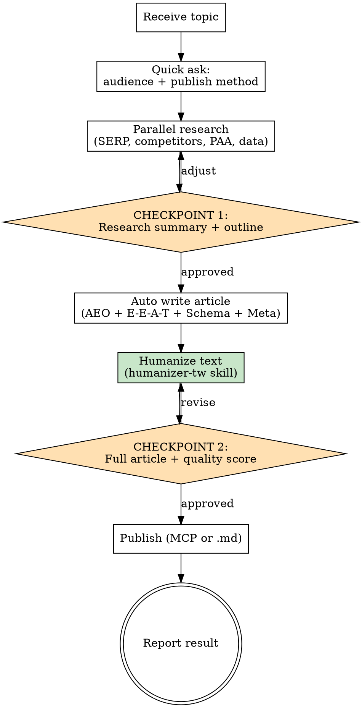

# Auto SEO Writer

Automated SEO/AEO article generator. Given a topic, automatically conducts research, writes the article, humanizes the text (removes AI writing patterns), and publishes — with only 2 confirmation checkpoints.

## Process Flow



---

## Phase 0: Quick Ask

Only ask these 2 questions (can be in one message):

```
1. Target audience?
   (e.g., marketers, WordPress site owners, e-commerce owners)

2. How to publish?
   a) MCP → which site? (list available sites via the WordPress MCP)
   b) Save as .md → which path? (default: ~/Desktop/)
```

> **MCP tool names**: exact tool names depend on the connected MCP server
> (examples in this skill assume `mcp__wordpress__*`). Check which WordPress
> MCP tools are actually available in the session before offering option (a);
> if no WordPress MCP is connected, only offer option (b).

If user gives no details, use defaults:
- Audience: general readers interested in the topic
- Publish: save as .md to ~/Desktop/

Everything else (word count, article type, keyword strategy) is **auto-determined** from research results.

---

## Phase 1: Parallel Research

Launch 3 parallel Agent tasks simultaneously:

**Agent A: SERP + Competitor Analysis**
- WebSearch the primary keyword
- Record SERP features (Featured Snippet, PAA, AI Overview, video carousel)
- Determine search intent (informational / commercial / navigational / transactional)
- WebFetch top 3-5 ranking articles
- Extract: heading structure, word count, subtopics covered, strengths, weaknesses, content gaps

**Agent B: PAA + Community Questions**
- WebSearch keyword variations: "[keyword] what/how/why/comparison/FAQ/recommended"
- Search English PAA if topic has English equivalent
- Search Reddit, PTT, forums for real user questions
- Categorize: definition / how-to / comparison / reason / recommendation

**Agent C: Data + Authority Sources**
- WebSearch: "[topic] statistics [current year]", "[topic] research report", "[topic] trends"
- Prioritize: Tier 1 (government, academic) > Tier 2 (Gartner, McKinsey) > Tier 3 (industry media)
- Record: data point, source, year, URL, credibility tier
- Cross-verify key stats with 2+ independent sources

---

## CHECKPOINT 1: Research Summary + Outline

Present to user:

```
Research Summary
================

Search Intent: [type] — users want to [...]
Competitors: analyzed X articles, avg word count Y
Key Gap: competitors lack [...]
Data Points: collected X citable stats
User Questions: mined X PAA questions

Our Differentiation:
  [one sentence on unique value]

Recommended word count: [X,XXX] (competitor avg + 20%)
Recommended format: [guide / listicle / comparison]

Proposed Outline
================

# H1: [title with primary keyword, under 60 chars]

## H2: What is [topic]? (definition block)
## H2: Why [topic] matters
   ### H3: [subtopic 1]
   ### H3: [subtopic 2]
## H2: How to [do something] — step-by-step
   ### H3: Step 1
   ### H3: Step 2
## H2: [topic] best practices
## H2: Common mistakes
## H2: FAQ (from PAA)
## H2: Conclusion + action items

Proceed? Or adjust anything?
```

Wait for user confirmation. If user adjusts, revise and re-present. Only proceed when approved.

---

## Phase 2: Auto Write

Once outline approved, write the full article automatically. Follow these rules:

### AEO Golden Rules
- First 40-60 chars of every H2/H3 section: **direct answer** (no filler intros)
- One data point per 150-200 words with source and year
- Question-format headings (what / how / why)
- Self-contained paragraphs (readable without context)
- Consistent entity naming throughout

### E-E-A-T Signals
- **Experience**: include first-person testing/operation descriptions
- **Expertise**: specific numbers, technical details, correct terminology
- **Authoritativeness**: cite credible sources (reports, official docs, institutions)
- **Trustworthiness**: mark data sources, update dates, present pros AND cons

### Content Format
- H1 (unique) > H2 (main sections) > H3 (subsections) — never skip levels
- Paragraphs: 3-5 sentences, under 120 chars per dense block
- Lists: use for 3+ parallel items
- Bold: max 1-2 key concepts per paragraph

### Required Elements
1. **Definition box** at article start:
```html
<div class="definition-box" style="background:#f8f9fa;border-left:4px solid #0073aa;padding:16px 20px;margin:20px 0;border-radius:4px;">
<strong>[Topic]</strong>: [40-60 char precise definition, AI-quotable format]
</div>
```

2. **FAQ section** (5+ Q&As from PAA research)

3. **Schema Markup** (JSON-LD): Article + FAQPage + BreadcrumbList

4. **SEO Meta**:
   - Title Tag (under 60 chars, contains primary keyword)
   - Meta Description (150-155 chars, has CTA)
   - Focus Keyword
   - URL Slug (lowercase English, hyphens)

---

## Phase 2.5: Humanize Text

After writing is complete, remove AI writing patterns from the article. This step is automatic — do NOT skip it.

**Invoke the `humanizer-tw` skill if it is installed.** If it is not available in this session, do NOT skip this phase — apply the rules below directly yourself:

- Remove opening clichés (「隨著...的發展」「眾所周知」)
- Cut excessive connectors (「此外」「與此同時」「首先...其次...最後」)
- Replace internet jargon with plain words
- Fix translation-ese (「這是一個...的事情」, stacked 「的」)
- Make formal language conversational (「予以」→「給」, 「該」→「這個」)
- Vary sentence rhythm (mix short and long sentences)
- Break formulaic structures (intro-3points-conclusion)
- Replace cliché endings with specific conclusions
- Inject personality and real voice

**Important**: Preserve all SEO elements during humanization:
- Keep H1/H2/H3 structure and keywords intact
- Keep data citations with sources and years
- Keep the definition box, FAQ section, and Schema markup
- Keep the AEO direct-answer openings (first 40-60 chars of each section)
- Only rewrite the prose style, not the informational structure

---

## CHECKPOINT 2: Article + Quality Check

Present the full article and auto-run quality check:

```
Quality Check (X/15)
====================

Structure:
  [pass/fail] H1 unique + contains primary keyword
  [pass/fail] Heading hierarchy continuous (no skipping)
  [pass/fail] FAQ section with 5+ Q&As
  [pass/fail] Definition box present
  [pass/fail] Conclusion + action items section

AEO Optimization:
  [pass/fail] Every H2 opens with 40-60 char direct answer
  [pass/fail] Question-format headings
  [pass/fail] Data points have source + year
  [pass/fail] FAQPage Schema generated

E-E-A-T Signals:
  [pass/fail] First-person testing/operation descriptions
  [pass/fail] Credible external sources cited
  [pass/fail] Author info configured

SEO Technical:
  [pass/fail] Title Tag <= 60 chars
  [pass/fail] Meta Description 150-155 chars
  [pass/fail] URL Slug lowercase English
  [pass/fail] Article + BreadcrumbList Schema generated

Score: X/15
```

If score < 12/15, auto-fix failing items before presenting. Present fixed version.

Wait for user confirmation. If user requests revisions, apply and re-check. Only proceed when approved.

---

## Phase 3: Publish

Based on user's choice from Phase 0:

### Option A: MCP Publish

> Tool names below assume a WordPress MCP server exposing `mcp__wordpress__*`.
> Use the equivalent tools actually available in the session. If none exist,
> tell the user and fall back to Option B.

1. `mcp__wordpress__list_sites` — confirm target site
2. `mcp__wordpress__list_categories` — find or create category via `mcp__wordpress__create_category`
3. `mcp__wordpress__list_tags` — find or create tags via `mcp__wordpress__create_tag`
4. **Internal links**: search the site's existing posts (list/search posts) for 2-3
   relevant articles and link to them where naturally fitting in the body.
   Skip silently if the site has no related content yet.
5. `mcp__wordpress__create_post` — publish with:
   - title, content (HTML), excerpt, slug, status (draft first)
   - categories, tags
   - SEO meta (Yoast/RankMath fields if supported)
6. Report: post ID, URL, status

### Option B: Save as Markdown

1. Save article to specified path (default `~/Desktop/[slug].md`)
2. Include frontmatter:
```yaml
---
title: "Article Title"
date: YYYY-MM-DD
slug: article-slug
keywords: [primary, secondary1, secondary2]
description: "Meta description"
schema: |
  [JSON-LD here]
---
```
3. Report: file path

---

## Batch Mode

When the user provides multiple topics at once (a list, a spreadsheet, or "write articles about A, B, and C"), keep the same 2-checkpoint total — do NOT checkpoint per article:

1. **Phase 0 once** — one audience + one publish method for the whole batch (ask only if unclear).
2. **Research each topic** (Phase 1) — topics sequentially, the 3 agents within each topic in parallel.
3. **CHECKPOINT 1 (batch)** — present ALL research summaries + outlines in one message, clearly numbered per topic. User approves or adjusts per topic; only approved topics continue.
4. **Write + humanize** each approved article (Phase 2 + 2.5).
5. **CHECKPOINT 2 (batch)** — present each article's quality score and full text (or file path). User approves per article.
6. **Publish** all approved articles (Phase 3), then report one result table: topic / status / URL or file path.

---

## Language

- Traditional Chinese (繁體中文)
- Technical terms stay in English (SEO, AEO, GEO, E-E-A-T, Schema, JSON-LD, H1/H2/H3)
- First occurrence of English terms: add Chinese in parentheses (e.g., AEO (Answer Engine Optimization, 答案引擎優化))
- Numbers: use Arabic numerals
- Tone: professional but approachable, no academic jargon
